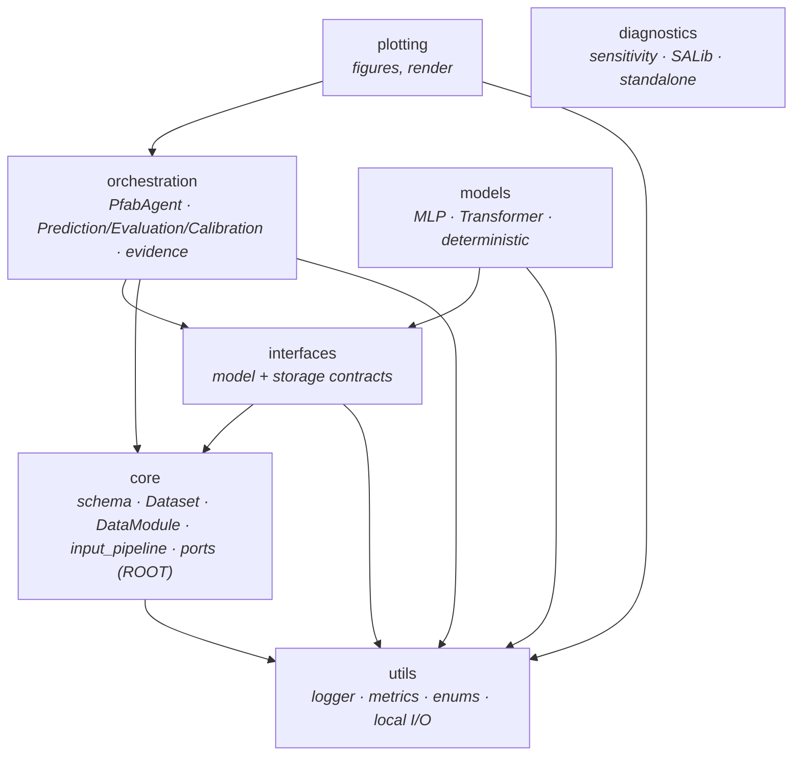
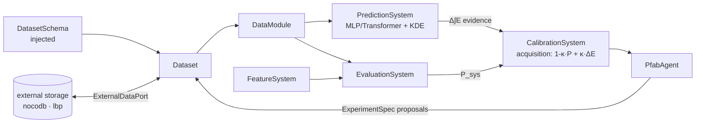

# PFAB — Project Context

- **Purpose** — schema-agnostic predictive-fabrication calibration framework: an active-learning loop that proposes experiment parameters (see [[PFAB - Predictive Fabrication]]).
- **Owns** — the data model, prediction/evaluation models, the evidence + acquisition optimiser, and the `PfabAgent` API. Stateless orchestrator parameterised by an injected schema.
- **Out of scope → who** — persistence/storage (`pred-fab-nocodb`); fabrication execution + hardware (`learning-by-printing`, `rtde-robot-control`); application-specific schemas/data generation (the consuming repo).
- **Depends on** — nothing internal at the data layer (`core` is the root); optional external-data adapters via the `ExternalDataPort` (defined in `core`, implemented by `interfaces.IExternalData` and the storage adapters). See [[Repo Dependency Graph]].

## Purpose (detail)
Predictive Fabrication (PFAB) framework: active-learning loop for manufacturing process calibration.
Combines ML-based prediction, evaluation scoring, and acquisition-driven optimization to propose
experiment parameters that balance exploration (evidence gain) and exploitation (performance).

## High-Level Flow
1. **Evaluate** — run feature and evaluation models on physical experiment data
2. **Train** — fit prediction models (MLP/Transformer) on historical dataset
3. **Propose** — acquisition optimizer proposes next experiments via κ-blended objective:
   - `A = (1-κ)·P_sys + κ·ΔE` where P_sys = weighted system performance, ΔE = evidence gain
   - κ=1.0 → discovery (pure space-filling via evidence), κ=0.0 → inference (pure performance)
4. **Execute** — apply proposed parameters; record results; repeat

## Architecture

The intended layering, enforced by the `import-linter` contract in
`.importlinter` (run `lint-imports`; ready to wire into CI/pre-commit —
neither exists in this repo yet).

### Layers (arrows = imports; a package may import only those below it)

`core` is the dependency root — it imports nothing upward. It owns the
`ExternalDataPort` Protocol (`core/ports.py`), so storage adapters depend
*inward* onto `core` rather than `core` reaching up into `interfaces` (this is
what broke the former `core ↔ interfaces` cycle; the contract now fails the
build if it returns). `models` and `orchestration` never import each other —
concrete models are injected into `PfabAgent` through the `interfaces`
contracts. `diagnostics` is a standalone consumer (SALib).

**Torch-free model surface.** Base install (`pip install pred-fab`) pulls only numpy; the
ML stack (torch/pandas/matplotlib) is the **`pred-fab[ml]`** extra. The dim/experiment
**model + per-position traversal** (`from pred_fab.core import Dimension, Domain,
DatasetSchema, ExperimentData, …` + `ExperimentData.get_effective_parameters_*`) imports
without torch/pandas — they're confined to the export/ML methods (lazy imports) and the
torch-bound `DataModule` is lazily exposed from `core/__init__`; `pred_fab/__init__` is
PEP 562-lazy so `import pred_fab` doesn't pull the ML stack. This is the surface external
consumers (e.g. rtde's per-dim recompute) import model-only. Guarded by
`tests/test_torch_free_model_import.py`. Consumers needing the ML stack depend on
`pred-fab[ml]`.

### Data flow (runtime pipeline)

`DataModule` and the deployable `InferenceBundle` share
`core/input_pipeline` (encode → order → normalize → slice) so inference can't
drift from training.

## Repo Structure

| Path | Role |
|------|------|
| `src/pred_fab/core/` | Data model, schema, DataModule, normalization |
| `src/pred_fab/interfaces/` | Model contracts (feature, evaluation, prediction) |
| `src/pred_fab/models/` | MLP, Transformer, DeterministicModel bases |
| `src/pred_fab/orchestration/` | System coordination (PfabAgent, CalibrationSystem, PredictionSystem, EvaluationSystem) |
| `src/pred_fab/orchestration/calibration/` | Acquisition optimizer: SolutionSpace (sigmoid variables), Engine (Sobol→LBFGS), BoundsManager |
| `src/pred_fab/orchestration/evidence.py` | KernelField ANOVA evidence estimator (marginal + joint integration) |
| `src/pred_fab/utils/` | Logging, console output (ProgressBar), metrics, local persistence |
| `src/pred_fab/plotting/` | Schema-agnostic visualization (see `PLOTTING_CONTEXT.md`) |
| `src/pred_fab/diagnostics/` | Sobol/Morris global sensitivity analysis |
| `concepts/` | Concept figures for paper — synthetic data demonstrations |
| `tests/` | Pytest suite |

## Entry Point
`PfabAgent` in `orchestration/agent.py` is the single integration surface for users.

## Key Concepts

### Acquisition Pipeline
- **SolutionSpace** — sigmoid-based variable encoding (z-space → [0,1] → DataModule z-score)
- **Engine** — Sobol global sampling → LBFGS local refinement
- **κ-blend** — `A = (1-κ)·P_sys + κ·ΔE`, negated and scaled for minimization
- **compute_acquisition_grids()** — single function for all plotting (slices through the real pipeline)

### Evidence System
- **KernelField ANOVA** — marginal (D independent 1D integrals, weight D/(D+1)) + joint (D-dim shell probes, weight 1/(D+1))
- **KDE weights** — 1/L per trajectory layer (each experiment contributes 1 total evidence unit)
- **Domain bounds** — actual latent-space bounds stored on KernelIndex, not hardcoded [0,1]
- **dimension_derivations** — per-axis derivation functions for domain axes (e.g., N_layers from layer_height)

### Performance System
- **predict_features()** → per-feature predictions via perf_fn_tensor closure
- **system_performance()** → weighted P_sys via combined_score (single source of truth)
- **Gradient flow** — decode emits grad-bearing raw directly; perf reads raw, evidence reads z-score (no inversion)

### Normalization
- **DataModule** — z-score normalization (StandardScalerModule) for ML training
- **SolutionSpace** — sigmoid/STE decode to [0,1] norm, then _decode_frames produces both raw and z-score
- **Context features** — default to z-score 0.0 (training mean) when not in optimization vector

### Metrics
- **R²** — standard coefficient of determination
- **R²_inf** — importance-weighted R², per-feature (weighted by that feature's performance scores)
- **MAE** — mean absolute error
- These are the only three metrics used everywhere (console, wandb, validation)

## Knowledge Base
Full project context, decisions, and research notes live in `../knowledge-base/` (Obsidian vault).
