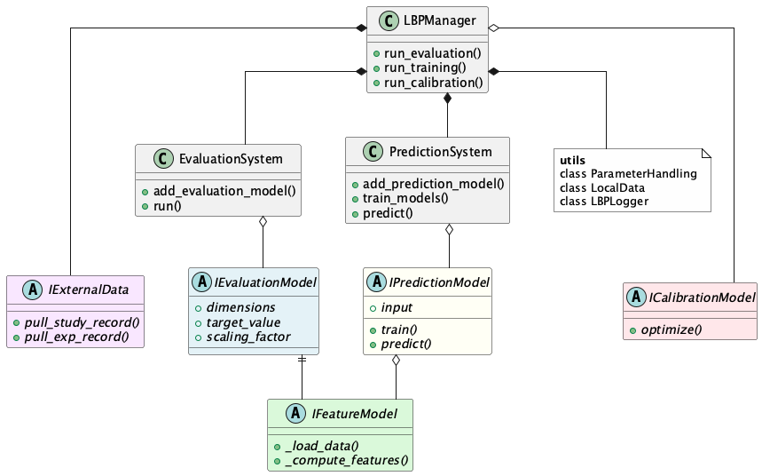

# Learning by Printing (LbP) Framework

A Python framework for iterative manufacturing process improvement through automated performance evaluation and optimization.

## Overview

Learning by Printing is an iterative manufacturing optimization approach that systematically improves printing processes through automated performance evaluation and parameter adjustment. The framework enables closed-loop learning where each experiment provides feedback for process refinement.

For detailed methodology, see: [An Introduction to Learning by Printing](https://mediatum.ub.tum.de/doc/1781543/1781543.pdf)

## Framework Structure

```
lbp_package/
├── interfaces/               # Abstract base classes defining contracts
│   ├── external_data.py     # Data source interface
│   ├── features.py          # Feature extraction interface  
│   ├── evaluation.py        # Performance evaluation interface
│   ├── prediction.py        # ML prediction interface
│   └── calibration.py       # Optimization interface
├── orchestration/           # Workflow management classes
│   ├── management.py        # LBPManager - main orchestrator
│   ├── evaluation.py        # EvaluationSystem
│   └── prediction.py        # PredictionSystem  
└── utils/                   # Supporting utilities
    ├── parameter_handler.py # Parameter management system
    ├── local_data.py        # File operations
    └── logger.py            # Logging utilities
```

## Architecture Overview



This diagram illustrates the interface-based architecture of the LBP framework, showing the relationships between core interfaces and orchestration components.

## Installation

### Prerequisites
- Python 3.9+
- Git

### Install from Source

```bash
# Clone repository
git clone <repository-url>
cd lbp-package

# Setup virtual environment and install dependencies
uv venv
source .venv/bin/activate  # On Windows: .venv\Scripts\activate
uv sync

# Or with pip
pip install -e .
```

### Dependencies

The framework has minimal core dependencies:
- `numpy` - Array operations and numerical computing
- `pandas` - Data structure handling for CSV export

**Note**: The [examples repository](https://github.com/your-org/lbp-examples) may have additional dependencies for visualization and domain-specific implementations, but the core framework is lightweight.

## Quick Start

```python
from lbp_package import LBPManager

# Initialize system (external data interface is optional)
manager = LBPManager(
    root_folder=".",
    local_folder="./data",
    log_folder="./logs"
    # external_data_interface=YourDataInterface()  # Optional
)

# Add your evaluation models (with weights for calibration)
manager.add_evaluation_model("performance_code", YourEvaluationModel, weight=1.0)

# Run workflows with optional flag overrides
manager.initialize_for_study("study_001")
manager.run_evaluation(
    "study_001",
    exp_nrs=[1, 2, 3], 
    debug_flag=True,  # Override default
    visualize_flag=True
)
```

For complete working examples, see the [LBP Examples Repository](https://github.com/your-org/lbp-examples).

## Core Concepts

### Parameter Management System
Elegant decorator-based system distinguishing three parameter types:

```python
@dataclass
class MyEvaluationModel(IEvaluationModel):
    # Study-level parameters (constant across all experiments)
    power_rating: float = study_parameter(50.0)
    max_speed: float = study_parameter(100.0)
    
    # Experiment-level parameters (vary between experiments)  
    layer_time: float = exp_parameter()
    temperature: float = exp_parameter(200.0)
    
    # Dimensional parameters (change during execution)
    layer_id: int = dim_parameter()
    segment_id: int = dim_parameter()
```

**Parameter Types:**
- **`@study_parameter`**: Study-wide constants shared across all experiments (numerical model configuration, equipment limits)
- **`@exp_parameter`**: Experiment-specific parameters that vary between experiments (numerical process settings, material properties)  
- **`@dim_parameter`**: Dynamic runtime parameters that change during execution to track current dimensional position

**Critical Parameter Requirements**:
- **Numerical types only**: Use `float` and `int` types for all parameters
- **No string parameters**: String parameters will cause errors in prediction and calibration workflows  
- **Default values**: Provide defaults for `@study_parameter` and `@exp_parameter` where possible
- **Type consistency**: Parameter types must match between record data and model declarations

**Automatic Parameter Access**: Once declared with decorators, parameters become automatically available as `self` attributes in all model methods.

### Dynamic Dimensionality System
Framework creates and manages multi-dimensional arrays automatically based on your dimension configuration:

**Concept**: Dimensionality defines the discrete evaluation structure - how your analysis is segmented (layers, segments, time steps, spatial regions, etc.). The framework dynamically creates and manages multi-dimensional arrays based on your dimension definitions.

**Key Benefits**:
- **Automatic Array Creation**: Framework creates feature and performance arrays sized `[n_layers, n_segments, ...]`
- **Dynamic Iteration**: Automatically loops through all dimensional combinations `(0,0), (0,1), (1,0), (1,1)`  
- **Database Alignment**: Dimension parameter names must match fields in your data records for dynamic configuration
- **Scalable**: Works with any number of dimensions - add new dimensions just by extending the lists

### Hierarchical Data Flow
Three-tier data management system providing complete database independence while enabling seamless integration:

**Data Loading Hierarchy** (Memory → Local → External):
1. **Memory First**: Check if data already loaded in current session
2. **Local Files**: Load from JSON/CSV files in local filesystem  
3. **External Source**: Query database/API only if data missing from local cache
4. **Automatic Caching**: Once loaded from external, automatically saved locally for future use

**Data Loading Control**:
- **`recompute_flag=False`**: Use hierarchical loading (memory → local → external)
- **`recompute_flag=True`**: Force loading from external source, bypassing local cache. Force overwritting of local files.

**Complete Database Independence**: Framework works fully without any external data interface. Manual data creation with JSON files supported. Add external data interface later without changing existing workflows.

### Data Separation of Concerns
Clear boundary between structured and unstructured data handling:

**Structured Data** (Handled by framework): Study/experiment records, feature arrays, performance results with standardized JSON/CSV format.

**Unstructured Data** (Complete user control): Domain-specific raw data (CAD files, sensor streams, images, proprietary formats) loaded via `FeatureModel._load_data()`.

## API Reference

The framework uses **interface-based design** with five core interfaces:

### IExternalData (Optional - Database/API Integration)

**Purpose**: Interface structured metadata access when integrating with databases/APIs. Framework works completely standalone without this interface.

**Required Methods:**
```python
def pull_study_record(self, study_code: str) -> Dict[str, Any]
def pull_exp_record(self, exp_code: str) -> Dict[str, Any]
```

**Required Record Structure:**

Study records must contain these fields:
```python
{
    "id": int,                    # Unique study identifier
    "Code": str,                  # Study code (matches study_code parameter)
    "Parameters": Dict[str, Any], # Study-level parameters (@study_parameter values)
    "Performance": List[str]      # List of performance metric codes
}
```

Experiment records must contain these fields:
```python
{
    "id": int,                    # Unique experiment identifier  
    "Code": str,                  # Experiment code (matches exp_code parameter)
    "Parameters": Dict[str, Any]  # Experiment-level parameters (@exp_parameter values)
}
```

**Optional Methods** (default implementations provided):
```python
def push_study_records(self, study_codes: List[str], data: Dict[str, Dict[str, Any]], recompute: bool) -> bool
def push_exp_records(self, exp_codes: List[str], data: Dict[str, Dict[str, Any]], recompute: bool) -> bool
def pull_aggr_metrics(self, exp_codes: List[str]) -> Tuple[List[str], Dict[str, Dict[str, Any]]]
def push_aggr_metrics(self, exp_codes: List[str], data: Dict[str, Dict[str, Any]], recompute: bool) -> bool
```

**Import**: `from lbp_package import IExternalData`

### IFeatureModel (Core - Domain-Specific Data Loading)

**Purpose**: Extract numerical features from domain-specific raw data. YOU have complete control over data format and loading mechanism.

**Required Methods:**
```python
def _load_data(self, exp_code: str, exp_folder: str, debug_flag: bool) -> Any
def _compute_features(self, data: Any, visualize_flag: bool) -> Dict[str, float]
```

**Return Structure Requirements**:
- `_compute_features()` must return `Dict[str, float]` with string keys and numerical values
- Feature keys become available for use in `IPredictionModel.input` field
- All values must be finite numbers (no NaN, inf) - framework validates automatically

**Key Responsibility**: Load unstructured data (CAD files, sensor streams, proprietary formats) and convert to numerical features.

**Parameter Access**: Use `@study_parameter`, `@exp_parameter`, `@dim_parameter` decorators - automatically available as `self.attribute_name`.

**Import**: `from lbp_package import IFeatureModel`

### IEvaluationModel (Core - Performance Assessment)

**Purpose**: Evaluate feature values against target values with automatic dimensionality handling.

**Required Properties:**
```python
@property
def dim_names(self) -> List[str]                    # ['layers', 'segments']
@property  
def dim_param_names(self) -> List[str]              # ['n_layers', 'n_segments'] 
@property
def dim_iterator_names(self) -> List[str]           # ['layer_id', 'segment_id']
@property
def feature_model_type(self) -> Type[IFeatureModel] # Associated feature model class
@property
def target_value(self) -> float                     # Performance target (NOT Optional!)
```

**Critical Naming Requirements**:
- `dim_param_names` must **exactly match** field names in experiment record `"Parameters"` section
- `dim_iterator_names` must **exactly match** `@dim_parameter` attribute names in your class
- Mismatch will cause runtime errors during dimension configuration

**Key Responsibility**: Framework automatically creates multi-dimensional arrays and iterates through all combinations based on your dimension configuration.

**Import**: `from lbp_package import IEvaluationModel`

### IPredictionModel (Optional - ML Workflows)

**Purpose**: Train ML models on evaluation results and predict performance for new parameter combinations.

**Required Properties:**
```python
@property
def input(self) -> List[str]                                # Input feature names
@property  
def dataset_type(self) -> IPredictionModel.DatasetType     # AGGR_METRICS or METRIC_ARRAYS
```

**Required Methods:**
```python
def train(self, X: np.ndarray, y: np.ndarray) -> Dict[str, Any]
def predict(self, X: np.ndarray) -> np.ndarray
```

**Input Field Requirements**:
- `input` field names must match available parameter names or feature keys
- Framework automatically extracts these fields from experiment records and feature results
- Use parameter names from `@study_parameter`, `@exp_parameter`, or feature keys from `_compute_features()`

**Required Return Structure for `train()`**:
```python
{
    "training_score": float,      # Primary metric (R² for regression, accuracy for classification)  
    "training_samples": int       # Number of training samples used
}
```

**DatasetType Options**:
- `AGGR_METRICS`: Uses aggregated performance metrics for training
- `METRIC_ARRAYS`: Uses granular metric arrays for training

**Import**: `from lbp_package import IPredictionModel`

### ICalibrationModel (Optional - Process Optimization)

**Purpose**: Optimize process parameters using any optimization algorithm of your choice.

**Required Method:**
```python
def optimize(self, param_ranges: Dict[str, Tuple[float, float]], 
             objective_fn: Callable[[Dict[str, float]], float]) -> Dict[str, float]
```

**Key Responsibility**: Implement optimization logic. Framework provides objective function based on evaluation model weights. You choose the optimization algorithm (scipy, scikit-optimize, genetic algorithms, etc.).

**Import**: `from lbp_package import ICalibrationModel`

### LBPManager (Orchestration)

**Purpose**: Main orchestration class coordinating the complete learning workflow.

**Initialization:**
```python
from lbp_package import LBPManager

manager = LBPManager(
    root_folder=".", local_folder="./data", log_folder="./logs",
    external_data_interface=None,  # Optional
    debug_flag=False, recompute_flag=False, visualize_flag=True
)
```

**Model Registration:**
```python
manager.add_evaluation_model(performance_code: str, model_class: Type, weight: float = None)
manager.add_prediction_model(performance_codes: List[str], model_class: Type) 
manager.set_calibration_model(model_class: Type)
```

**Registration Requirements**:
- **`performance_code`**: Must match codes listed in study record `"Performance"` array
- **`weight`**: Required for calibration workflow - defines relative importance in multi-objective optimization
- **`performance_codes`** (prediction): Must be subset of registered evaluation model codes
- **Calibration dependency**: Requires at least one evaluation model with `weight > 0`

**Workflow Execution:**
```python
manager.initialize_for_study(study_code: str)
manager.run_evaluation(study_code: str, exp_nrs: List[int], **flag_overrides)
manager.run_training(study_code: str, exp_nrs: List[int], **flag_overrides)
manager.run_calibration(exp_nr: int, param_ranges: Dict[str, Tuple[float, float]])
```

**Flag System Requirements**:
- **`debug_flag`**: `True` = skip external data operations, `False` = use external data interface if available  
- **`recompute_flag`**: `True` = force recomputation and overwrite existing results, `False` = use cached results
- **`visualize_flag`**: `True` = enable visualizations during processing, `False` = skip visualizations
- **Flag precedence**: Method-level overrides > initialization defaults

**Parameter Range Requirements** (for calibration):
- Keys must match parameter names in experiment records
- Values must be `(min_value, max_value)` tuples with `min_value < max_value`
- Only numerical parameters supported - framework validates against `@exp_parameter` types

## Configuration

### Data Structure (Standalone Operation)

If working without external data interface, create these JSON structures manually:

**Study Record** (`./data/thermal_study/study_record.json`):
```json
{
    "id": 1,
    "Code": "thermal_study", 
    "Parameters": {
        "target_temp": 200.0,
        "sampling_rate": 1000.0
    },
    "Performance": [
        "temperature_control"
    ]
}
```

**Experiment Record** (`./data/thermal_study/thermal_study_001/exp_record.json`):  
```json
{
    "id": 1,
    "Code": "thermal_study_001",
    "Parameters": {
        "n_layers": 5,
        "n_segments": 8,
        "print_speed": 50.0
    }
}
```

The framework automatically creates the folder structure and manages all result files.

## Key Features

- **Interface-Based Design**: Clean contracts for feature extraction, evaluation, prediction, and calibration
- **Database Independence**: Works standalone with JSON files or integrates with existing databases  
- **Hierarchical Data Flow**: Automatic caching (memory → local → external) with recompute control
- **Dynamic Dimensionality**: Automatic multi-dimensional array management for complex analysis
- **Flag-Based Configuration**: Runtime control without configuration files - pure programmatic setup
- **Parameter Management**: Elegant decorator-based system for study, experiment, and dimensional parameters

## License

This project is licensed under the MIT License - see the [LICENSE](LICENSE) file for details.

<!-- ## Citation

If you use this framework in your research, please cite:

```bibtex
@article{learning_by_printing,
  title={An Introduction to Learning by Printing},
  author={Your Authors},
  journal={Your Journal},
  year={2024},
  url={https://mediatum.ub.tum.de/doc/1781543/1781543.pdf}
}
``` -->

## Support

- **Examples Repository**: [LBP Examples](https://github.com/your-org/lbp-examples) - Complete working implementations
- **Issues**: [GitHub Issues](https://github.com/your-org/lbp-package/issues) - Bug reports and feature requests
- **Discussions**: [GitHub Discussions](https://github.com/your-org/lbp-package/discussions) - Questions and community support
